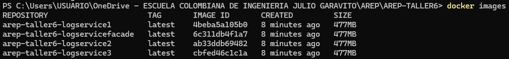
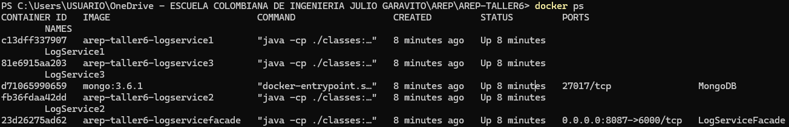

# TALLER 6: PATRONES ARQUITECTURALES

Aplicación web construida utilizando el micro-framework Spark Java, compuesta por un cliente web, un servicio REST y un servicio MongoDB. Se crearon contenedores de Docker para cada componente. El servicio REST implementa un algoritmo de balanceo de carga de Round Robin, distribuyendo las solicitudes a tres instancias del servicio LogService.

## Comenzando

Estas instrucciones te ayudarán a obtener una copia del proyecto en funcionamiento en tu máquina local para fines de desarrollo y pruebas.

### Requisitos previos

* Kit de desarrollo de Java (JDK) versión 11 o posterior
* Herramienta de construcción Maven
* Docker Desktop

### Instalar y Generar las imágenes

1. Asegúrate de tener Docker instalado en su máquina y que docker daemon esté ejecutándose.
2. Clona el repositorio:
    ```
    git clone https://github.com/AlexisGR117/AREP-TALLER6.git
    ```
3. Navega a la carpeta del proyecto:
    ```
    cd AREP-TALLER6
    ```
4. Construye el proyecto usando Maven:
    ```
    mvn clean install 
    ```
5. Inicia los servicios definidos en un archivo docker-compose.yml con:
    ```
    docker-compose up -d
    ```
6. Verifica que las imágenes se haya creado correctamente ejecutando el siguiente comando:
    ```
    docker images
    ```
   debe verse algo así:

   

7. De igual forma, asegúrate que los contenedores estén corriendo:
    ```
    docker ps
    ```
   debe verse algo así:

   
8. Abre un navegador web y accede a la aplicación en http://localhost:8087/formulario.html.


### Ejecutando las pruebas

Ejecuta las pruebas unitarias:
```
mvn test
```

## Arquitectura

La aplicación web está compuesta por tres servicios: MongoDB, LogService y LogServiceFacade. 
* **MongoDB** es una instancia de MongoDB que se ejecuta en un contenedor de Docker en una máquina virtual de EC2. 
* **LogService** es un servicio REST que recibe una cadena, la almacena en la base de datos MongoDB y devuelve un objeto JSON con las 10 últimas cadenas almacenadas en la base de datos y la fecha en que fueron almacenadas.
* **LogServiceFacade** está compuesta por un cliente web y un servicio REST. El cliente web tiene un campo y un botón, y cada vez que el usuario envía un mensaje, este se envía al servicio REST, que implementa un algoritmo de balanceo de cargas de Round Robin y delega el procesamiento del mensaje y el retorno de la respuesta a cada una de las tres instancias del servicio LogService.

La interfaz de usuario web permite al usuario ingresar un mensaje y ver los últimos 10 mensajes almacenados en la base de datos. La interfaz de usuario web se comunica con el servicio REST LogServiceFacade a través de una conexión HTTP.

En resumen, la arquitectura del taller consiste en una aplicación web que utiliza un algoritmo de balanceo de carga de Round Robin para distribuir las solicitudes a tres instancias de un servicio REST, que a su vez se comunica con una base de datos MongoDB. La aplicación web se despliega en un contenedor Docker en una instancia de EC2 de AWS, y se utiliza un balanceador de carga de Round Robin para gestionar el tráfico de Internet.

### Video con las pruebas y los despliegues funcionando

En el video se podrá ver cómo se hizo el despliegue en AWS y las pruebas correspondientes para verificar:
* La instancia de MongoDB este corriendo.
* LogService responde en un objeto JSON con las 10 últimas cadenas almacenadas en la base de datos y la fecha en que fueron almacenadas en la instancia de MongoDB.
* El cliente web tiene un campo y un botón y cada vez que el usuario envía un mensaje, este se lo envía al servicio REST y actualiza la pantalla con la información que este le regresa en formato JSON.
* El servicio REST implementa un algoritmo de balanceo de cargas de Round Robin, delegando el procesamiento del mensaje y el retorno de la respuesta a cada una de las tres instancias del servicio LogService.

[](https://www.youtube.com/watch?v=RlQumvKEDjM)

## Authors

* Jefer Alexis González Romero
